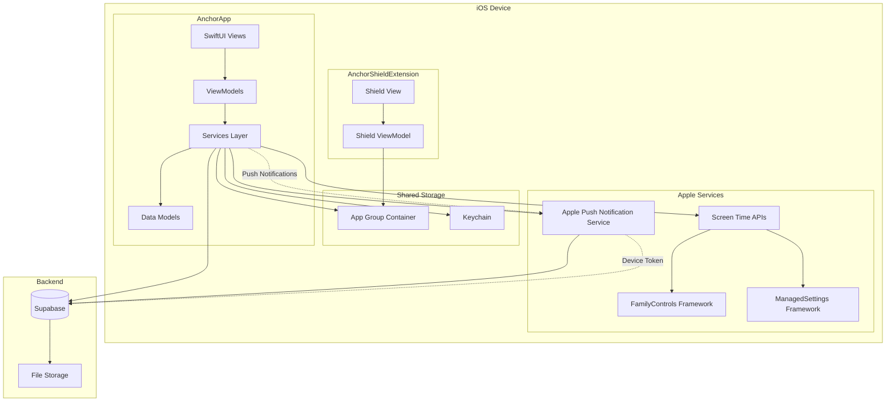

# System Architecture

This document describes the high-level architecture of the Anchor iOS application.

## Architecture Diagram

## Component Descriptions

### AnchorApp
- **SwiftUI Views**: User interface components organized by feature
- **ViewModels**: Business logic and state management using MVVM pattern
- **Services Layer**: Handles API calls, Screen Time integration, authentication, etc.
- **Data Models**: Swift structs representing domain entities

### AnchorShieldExtension
- **Shield View**: Custom UI shown when blocked apps are opened
- **Shield ViewModel**: Reads session state from App Group storage

### Shared Storage
- **App Group Container**: Shared UserDefaults/file storage between app and extension
- **Keychain**: Secure storage for authentication tokens

### Apple Services
- **Screen Time APIs**: FamilyControls, ManagedSettings, DeviceActivity
- **APNs**: Push notification delivery

### Backend
- **Supabase**: PostgreSQL database and REST API
- **File Storage**: Image/proof file storage (Supabase Storage or similar)

## Data Flow

1. **User starts session**: App → ScreenTimeService → ManagedSettings → System
2. **User opens blocked app**: System → Shield Extension → App Group → Shield UI
3. **User requests unlock**: App → Backend → Friend's App (via push) → Backend → App → ScreenTimeService
4. **Friend approves**: Friend's App → Backend → App → ScreenTimeService → ManagedSettings

