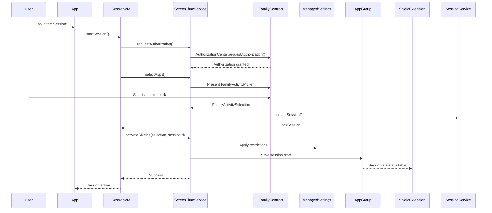
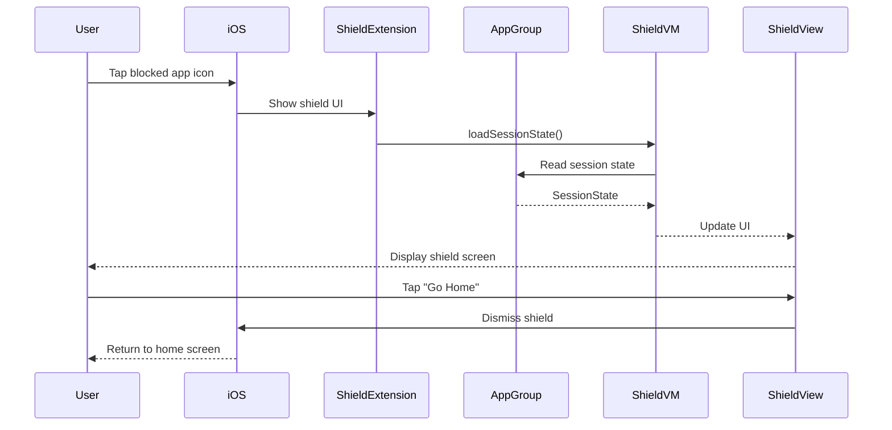
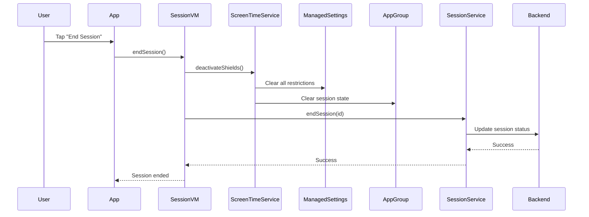

# Screen Time Flow

This document describes the sequence of events for Screen Time integration.

## Starting a Session

```mermaid
sequenceDiagram
    participant User
    participant App
    participant SessionVM
    participant ScreenTimeService
    participant FamilyControls
    participant ManagedSettings
    participant AppGroup
    participant ShieldExtension
    
    User->>App: Tap "Start Session"
    App->>SessionVM: startSession()
    SessionVM->>ScreenTimeService: requestAuthorization()
    ScreenTimeService->>FamilyControls: AuthorizationCenter.requestAuthorization()
    FamilyControls-->>ScreenTimeService: Authorization granted
    SessionVM->>ScreenTimeService: selectApps()
    ScreenTimeService->>FamilyControls: Present FamilyActivityPicker
    User->>FamilyControls: Select apps to block
    FamilyControls-->>ScreenTimeService: FamilyActivitySelection
    SessionVM->>SessionService: createSession()
    SessionService-->>SessionVM: LockSession
    SessionVM->>ScreenTimeService: activateShields(selection, sessionId)
    ScreenTimeService->>ManagedSettings: Apply restrictions
    ScreenTimeService->>AppGroup: Save session state
    AppGroup-->>ShieldExtension: Session state available
    ScreenTimeService-->>SessionVM: Success
    SessionVM-->>App: Session active
```

## User Opens Blocked App

```mermaid
sequenceDiagram
    participant User
    participant iOS
    participant ShieldExtension
    participant AppGroup
    participant ShieldVM
    participant ShieldView
    
    User->>iOS: Tap blocked app icon
    iOS->>ShieldExtension: Show shield UI
    ShieldExtension->>ShieldVM: loadSessionState()
    ShieldVM->>AppGroup: Read session state
    AppGroup-->>ShieldVM: SessionState
    ShieldVM-->>ShieldView: Update UI
    ShieldView-->>User: Display shield screen
    User->>ShieldView: Tap "Go Home"
    ShieldView->>iOS: Dismiss shield
    iOS-->>User: Return to home screen
```

## Ending a Session

```mermaid
sequenceDiagram
    participant User
    participant App
    participant SessionVM
    participant ScreenTimeService
    participant ManagedSettings
    participant AppGroup
    participant SessionService
    participant Backend
    
    User->>App: Tap "End Session"
    App->>SessionVM: endSession()
    SessionVM->>ScreenTimeService: deactivateShields()
    ScreenTimeService->>ManagedSettings: Clear all restrictions
    ScreenTimeService->>AppGroup: Clear session state
    SessionVM->>SessionService: endSession(id)
    SessionService->>Backend: Update session status
    Backend-->>SessionService: Success
    SessionService-->>SessionVM: Success
    SessionVM-->>App: Session ended
```

