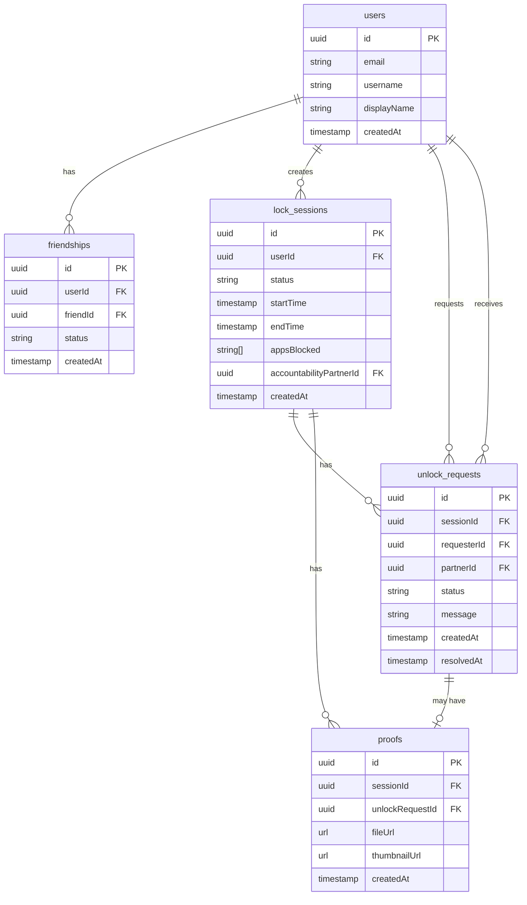

# Data Model

This document describes the database schema and entity relationships.

## Entity Descriptions

### users
Stores user account information including authentication credentials and profile data.

### friendships
Represents the friendship relationship between two users. Status can be:
- `pending`: Friend request sent but not yet accepted
- `accepted`: Friendship confirmed
- `blocked`: User has blocked the friend

### lock_sessions
Represents a focus session where apps are blocked. Status can be:
- `active`: Session is currently running
- `completed`: Session ended normally
- `cancelled`: Session was cancelled early

### unlock_requests
Represents a request to unlock apps before session completion. Status can be:
- `pending`: Awaiting partner's response
- `approved`: Partner approved the unlock
- `denied`: Partner denied the unlock

### proofs
Stores photo proof images associated with sessions or unlock requests.

## Relationships

- **users ↔ friendships**: One-to-many (user can have many friendships)
- **users ↔ lock_sessions**: One-to-many (user can create many sessions)
- **users ↔ unlock_requests**: One-to-many (user can request/receive many unlock requests)
- **lock_sessions ↔ unlock_requests**: One-to-many (session can have multiple unlock requests)
- **lock_sessions ↔ proofs**: One-to-many (session can have multiple proofs)
- **unlock_requests ↔ proofs**: One-to-one (unlock request can have one proof)

