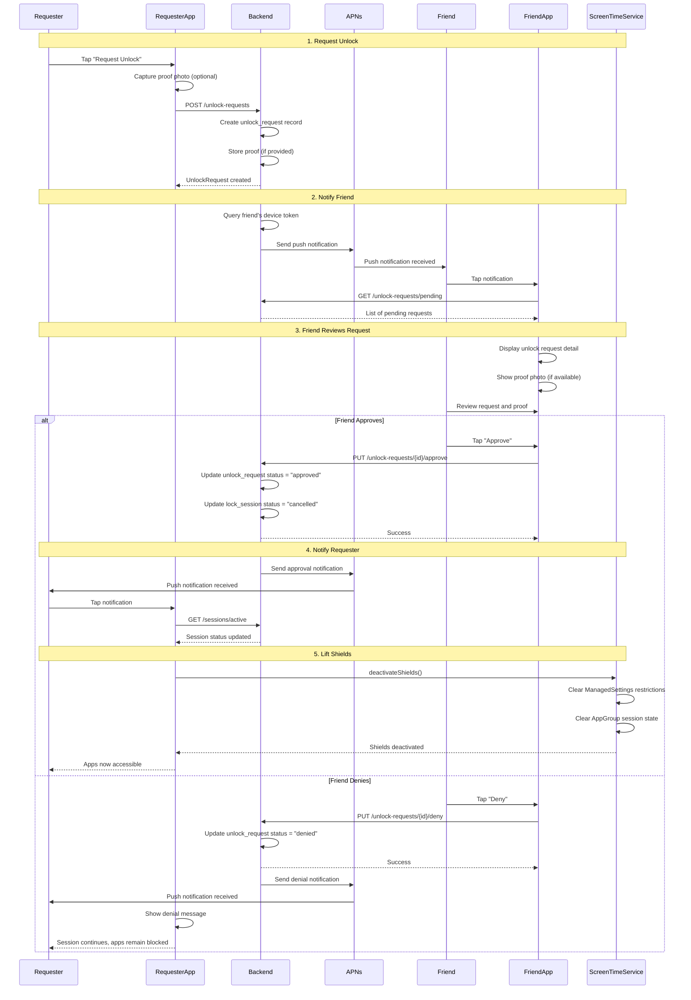

# Friend Unlock Sequence

This document describes the complete flow of requesting and approving an unlock.

## Key Steps

1. **Request Unlock**: User creates unlock request with optional photo proof
2. **Notify Friend**: Backend sends push notification to accountability partner
3. **Friend Reviews**: Partner sees request details and proof (if provided)
4. **Decision**: Partner approves or denies the request
5. **Update Session**: Backend updates unlock request and session status
6. **Lift Shields**: If approved, Screen Time restrictions are removed

## Error Handling

- If friend's device is offline, notification is queued and delivered when device comes online
- If requester's app is closed, notification will open app to show updated session status
- If Screen Time deactivation fails, app will retry and show error to user

